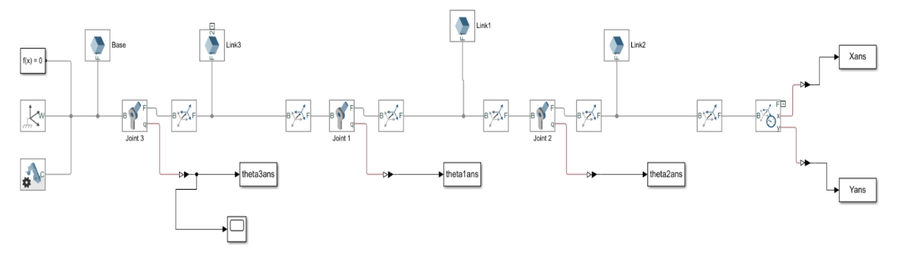

# 2103496 Advanced Topics in Mechanical Engineering 2, Chulalongkorn University, 2018

## Project1: Optimizing energy in Genpath Energy Generation

### 1. Modeling the system

### 2. Building a simulink model

### 3. Optimizing energy by varying parameters in the system

## Project2: 3DOF Industrial Robot

### 1. Forward kinematics calculation

### 2. Inverse kinematics calculation

### 3. Comparing forward and inverse kinematics

### 4. Modeling the system (Simulink) bases on equation of motion (without controller)

VDO: [3dof without controller](https://github.com/saeth40/Advanced-dynamics/blob/main/3Dof%20Industrial%20Robot/VDO/Linkage%20Free%20Fall.mp4).

### 5. Modeling the system (Simulink) bases on equation of motion (with controller)

VDO: [3dof with controller](https://github.com/saeth40/Advanced-dynamics/blob/main/3Dof%20Industrial%20Robot/VDO/Linkage%20With%20Control.mp4).
